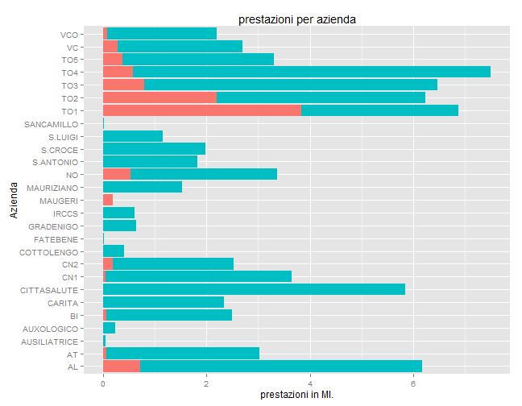
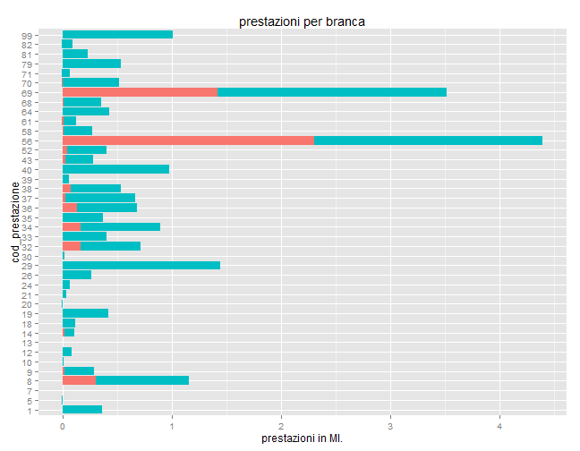
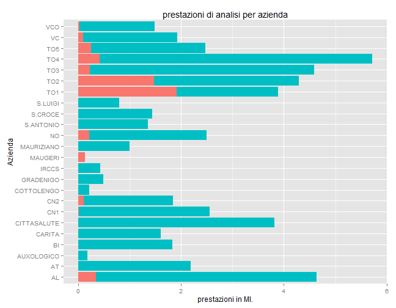
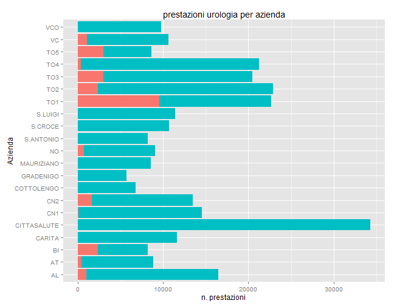
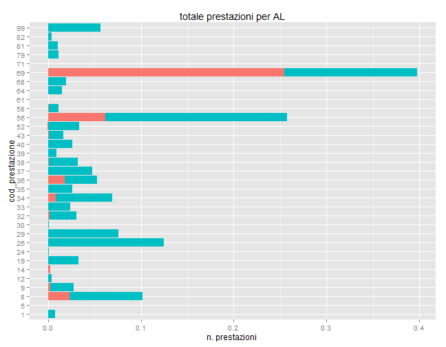
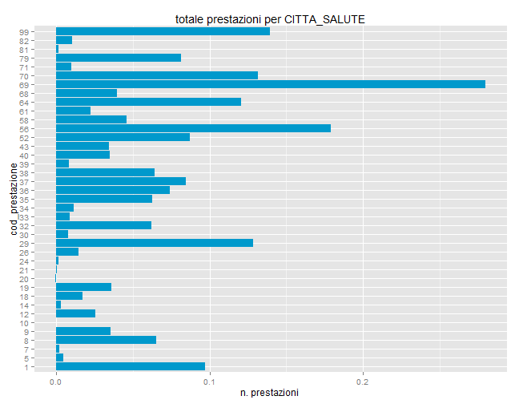
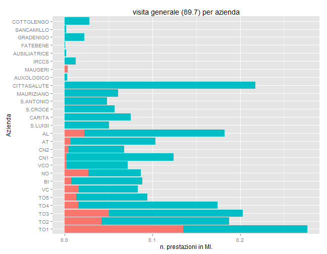

Prestazioni sanitarie in Regione Piemonte
----------------------------

### Fonte

Sul sito dedicati agli [Opendata] (http://www.dati.piemonte.it)  sono stai pubblicati le [Prestazioni sanitarie erogate nel 2012] (http://rpubs.com/varmatieto/19289).

Il database *Prestazioni Sanitarie*, contiene 295643 osservazioni su  5 variabili.

Ciascuna osservazione riporta:

- il codice azienda sanitaria, 

- il codice prestazione, 

- la relativa branca, 

- l'indicazione pubblico o privato,

- la quantità di prestazioni erogate.

Le prime osservazioni del database risultano:


```
##   azienda tipo cbranca   cpres  qta
## 1     202 Priv      69   88.27  520
## 2     201 Priv      98 90.23.5 3598
## 3     202  Pub      98 90.44.3  140
## 4     212  Pub      98 90.69.4 8317
## 5     909  Pub      98 90.76.1  618
## 6     909  Pub      98 90.23.3  648
```


La somma complessiva delle prestazioni erogate è oltre 73 miloni.

Considerando che sono presenti  1796 prestazioni differenti ciascuna e' stata erogata mediamente 40808 volte.


#### plot  1

La somma complessiva delle prestazioni si ripartisce sulle 27 aziende secondo la **figura 1** ( dove sono riportate in rosso le prestazioni in strutture private, in blu quelle in strutture pubbliche).


 

#### plot  2

La somma complessiva delle prestazioni si ripartisce sulle 43  discipline  presenti nel dataset secondo la **figura 2**.

Non e' stata qui riportata la disciplina 98 "ANALISI DI LABORATORIO" che totalizza, da sola, oltre 50 milioni di prestazioni.


 


#### plot  3

La somma complessiva delle prestazioni si ripartisce per la disciplina 98 "ANALISI DI LABORATORIO"  sulle diverse aziende sanitarie secondo la **figura 3**.


 


#### plot  4

La somma complessiva delle prestazioni si ripartisce per la disciplina 43 "UROLOGIA"  sulle diverse aziende sanitarie secondo la **figura 4**.


 

#### plot  5

Osserviamo ora le prestazioni svolte dall' azienda "213" corrispondente ad ALESSANDRIA in **figura 5**.

 


#### plot  6

Osserviamo ora le prestazioni svolte dall' azienda "909" corrispndente ad CITTA_SALUTE in **figura 6**.

 


#### plot  7

Da ultimo riportiamo la distribuzione di una singola prestazione con codice "89.7" e significato "VISITA GENERALE" che da sola totalizza 3.17 %
di tutte le 1796 prestazioni.

 
